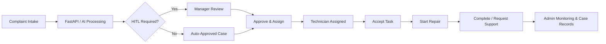

# SmartOps AI

**AI-Assisted Hotel Maintenance Complaint Management System**  
**Champion — BBA Capstone Showcase 2026**

SmartOps AI is a Business Analytics capstone project that brings complaint intake, AI-assisted maintenance classification, Human-in-the-Loop (HITL) review, technician assignment, SLA monitoring and maintenance case tracking into one operational workflow.

This repository showcases the **web application and integration layer** of the project, including the Admin Portal, Technician Website, MySQL data model, dashboard logic and FastAPI integration used to connect upstream AI outputs with downstream maintenance execution.

> Portfolio note: this is an academic demonstration system. The GitHub version uses sample/demo data and excludes local secrets, presentation-only authentication bypasses and guest messaging identifiers.

## Project Highlights

- **Award-winning capstone:** Champion, BBA Capstone Showcase 2026.
- **Business-to-system translation:** maintenance requirements were converted into workflow rules, database structures, dashboards and role-based interfaces.
- **Operational analytics:** KPI views and drill-through records support case monitoring, SLA analysis and technician workload visibility.
- **Human-in-the-Loop governance:** safety-related, low-confidence, OUT_OF_KB, High and Critical cases can be routed for manager review before assignment.
- **End-to-end workflow:** approved cases move from Admin review and assignment to Technician acceptance, repair and completion.
- **Database-backed implementation:** PHP pages use MySQL with prepared queries and shared data structures across Admin and Technician modules.

## My Contribution

My work focused on the **SmartOps AI web and business analytics implementation**, including:

- translating maintenance requirements and workflow rules into the web system;
- developing and organising the Admin and Technician interfaces;
- integrating PHP pages with the MySQL database;
- implementing operational dashboards, KPI views and drill-through records;
- implementing the Admin-to-Technician assignment and task-status workflow; and
- supporting integration testing with the team components responsible for RAG-LLM, HITL governance and API integration.

The wider capstone was completed collaboratively. AI/RAG and governance components are described here only where they interface with the web workflow.

## System Workflow



## Main Modules

### Admin Portal

- Executive Overview and operational KPIs
- Smart Maintenance Intelligence
- HITL Escalation review queue
- Workforce and Task Monitoring
- Maintenance Case Records and CRUD functions
- Technician Management
- Role-based login and session access control

### Technician Website

- Assigned tasks
- In Progress tasks
- Support requests
- Overdue tasks
- Task history and account settings
- Accept, start repair, complete and request-support actions
- Mobile phone-frame interface with internal scrolling

## Business Rules Demonstrated

- Technician task acceptance target: **30 minutes** from assignment.
- Repair target: **90 minutes** from repair start.
- A technician can handle only **one active task** at a time.
- Support cases are managed separately and may be transferred to an appropriate technician after review.
- Cases requiring governance review are held for HITL approval before normal assignment.

## Technology Stack

| Area | Technologies |
| --- | --- |
| Front end | HTML, CSS, JavaScript |
| Server side | PHP |
| Database | MySQL, PDO / prepared queries |
| API integration | FastAPI, REST/JSON |
| Analytics UI | KPI cards, dashboard charts, filters, drill-through tables |
| Development environment | XAMPP / WAMP-compatible local setup |
| Team workflow | Agile Scrum |

## Repository Structure

```text
smartops-ai/
├── admin_portal/            # Admin dashboard, HITL, workforce, records, technicians
├── technician_website/      # Technician mobile workflow
├── assets/                  # Shared Admin CSS and JavaScript
├── includes/                # Shared PHP helpers and layouts
├── config/                  # Database/API config and local config template
├── smartops_fastapi/        # FastAPI integration layer
├── phpmyadmin_database/     # Sanitised demo MySQL snapshot
├── data/                    # Small synthetic AI-pipeline example
├── docs/screenshots/        # Portfolio screenshots can be added here
├── DEVELOPER_CODE_INDEX.md  # Code map for major modules
└── SECURITY.md              # Public-repository security notes
```

## Local Setup

### 1. Requirements

- PHP 8+
- MySQL / MariaDB
- XAMPP or WAMP
- Python 3.10+ if the FastAPI integration is required

### 2. Configure PHP / MySQL

Copy the example local configuration:

```bash
cp config/local.example.php config/local.php
```

Update `config/local.php` for your local database and choose local-only Admin / Technician reset codes. The real `config/local.php` is excluded by `.gitignore`.

### 3. Start the web application

Place the project folder in the XAMPP `htdocs` directory, start Apache and MySQL, then open:

```text
http://localhost/<project-folder>/
```

The project includes a bundled **sanitised demo SQL snapshot** for local demonstration.

### 4. Create a local Admin account

Open the Admin sign-up page and use the local Admin access code configured in `config/local.php`. Passwords are stored as hashes in MySQL; no plaintext portfolio credential is published in this repository.

### 5. Optional FastAPI integration

```bash
cd smartops_fastapi
python3 -m venv .venv
source .venv/bin/activate
pip install -r requirements.txt
cp .env.example .env
```

On Windows, activate the virtual environment with:

```text
.venv\Scripts\activate
```

Then configure `.env` for the local MySQL database and, when available, the separate ML/RAG service.

## Sample Integration Payload

A small synthetic example is included at:

```text
data/sample_pipeline_result.json
```

It demonstrates the structure passed from AI classification/governance into the SmartOps web workflow without publishing the original team pipeline dump or guest identifiers.

## Screenshots

For a portfolio presentation, the most useful screenshots are:

1. Executive Overview dashboard
2. HITL Escalation queue
3. Admin approve-and-assign screen
4. Technician Assigned / In Progress mobile screen

Place them in `docs/screenshots/` and embed the best three or four images in this section. Keeping the screenshots focused is more useful to interviewers than showing every page.

## Security and Scope

This is an academic portfolio system rather than a production hotel platform. Public-repository secrets are excluded, guest messaging identifiers are removed from the bundled dataset, and classroom-only login bypasses are not included. See [`SECURITY.md`](SECURITY.md) for details.

## Academic Context

**Programme:** Bachelor of Business Analytics (Honours), Sunway University  
**Project:** BBA Capstone Showcase 2026  
**Achievement:** Champion

The project demonstrates the use of business analysis, operational data, database design, dashboards and system integration to support a real-world maintenance management workflow.
